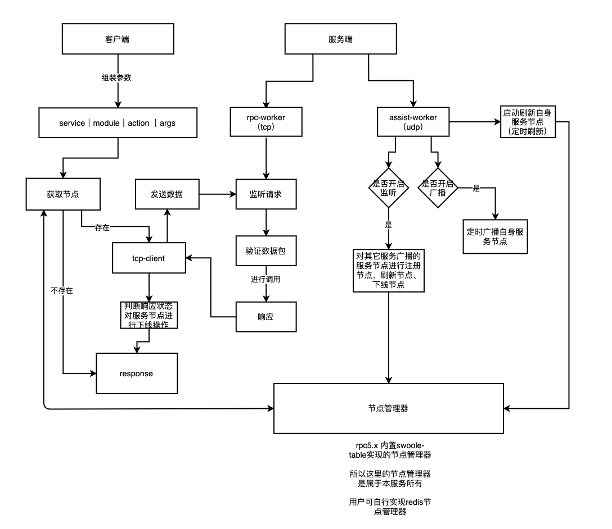

# EasySwoole RPC

很多传统的Phper并不懂RPC是什么，RPC全称Remote Procedure Call，中文译为远程过程调用,其实你可以把它理解为是一种架构性上的设计，或者是一种解决方案。
例如在某庞大商场系统中，你可以把整个商场拆分为N个微服务（理解为N个独立的小模块也行），例如：
    
- 订单系统
- 用户管理系统
- 商品管理系统
- 等等 

那么在这样的架构中，就会存在一个Api网关的概念，或者是叫服务集成者。我的Api网关的职责，就是把一个请求
，拆分成N个小请求，分发到各个小服务里面，再整合各个小服务的结果，返回给用户。例如在某次下单请求中，那么大概
发送的逻辑如下：
- Api网关接受请求
- Api网关提取用户参数，请求用户管理系统，获取用户余额等信息，等待结果
- Api网关提取商品参数，请求商品管理系统，获取商品剩余库存和价格等信息，等待结果。
- Api网关融合用户管理系统、商品管理系统的返回结果，进行下一步调用（假设满足购买条件）
- Api网关调用用户管理信息系统进行扣款，调用商品管理系统进行库存扣减，调用订单系统进行下单（事务逻辑和撤回可以用请求id保证，或者自己实现其他逻辑调度）
- APi网关返回综合信息给用户

而在以上发生的行为，就称为远程过程调用。而调用过程实现的通讯协议可以有很多，比如常见的HTTP协议。而EasySwoole RPC采用自定义短链接的TCP协议实现，每个请求包，都是一个JSON，从而方便实现跨平台调用。

什么是服务熔断？
 
粗暴来理解，一般是某个服务故障或者是异常引起的，类似现实世界中的‘保险丝’，当某个异常条件被触发，直接熔断整个服务，而不是一直等到此服务超时。

什么是服务降级?

粗暴来理解，一般是从整体负荷考虑，就是当某个服务熔断之后，服务器将不再被调用，此时客户端可以自己准备一个本地的fallback回掉，返回一个缺省值，这样做，虽然服务水平下降，但好歹，比直接挂掉要强。
服务降级处理是在客户端实现完成的，与服务端没有关系。

什么是服务限流？

粗暴来理解，例如某个服务器最多同时仅能处理100个请求，或者是cpu负载达到百分之80的时候，为了保护服务的稳定性，则不在希望继续收到
新的连接。那么此时就要求客户端不再对其发起请求。因此EasySwoole RPC提供了NodeManager接口，你可以以任何的形式来
监控你的服务提供者，在getNodes方法中，返回对应的服务器节点信息即可。  

## EasySwoole RPC执行流程



## Composer安装

```
composer require easyswoole/rpc=5.x
``` 

## rpc配置

```php
<?php

// 构造方法内用户可传入节点管理器实现`NodeManagerInterface` 默认`MemoryManager`
$config = new \EasySwoole\Rpc\Config();

/** 服务端配置 */

// 设置服务名称
$config->setServerName('User'); // 默认 EasySwoole

// 设置节点id
$config->setNodeId(\EasySwoole\Utility\Random::character(10)); // 可忽略 构造函数已经设置

// 设置异常处理器 对Service-Worker 和 AssistWorker的异常进行处理 必须设置 防止未捕获导致进程退出
$config->setOnException(function (\Throwable $throwable) {

});

$serverConfig = $config->getServer();

// 设置本机ip 必须设置
$serverConfig->setServerIp('127.0.0.1');

// 设置工作进程数量
$serverConfig->setWorkerNum(4);

// 设置监听地址及端口
$serverConfig->setListenAddress('0.0.0.0');
$serverConfig->setListenPort('9600');

// 设置服务端最大接受包大小
$serverConfig->setMaxPackageSize(1024 * 1024 * 2);

// 设置接收客户端数据时间
$serverConfig->setNetworkReadTimeout(3);

/** 广播设置 */

$assistConfig = $config->getAssist();

// 服务定时自刷新到节点管理器
$assistConfig->setAliveInterval(5000);

// 广播进程设置
$serviceFinderConfig = $assistConfig->getUdpServiceFinder();

// 监听地址和端口
$serviceFinderConfig->setEnableListen(true);
$serviceFinderConfig->setListenAddress('0.0.0.0');
$serviceFinderConfig->setListenPort(9600);

// 设置广播地址
$serviceFinderConfig->setEnableBroadcast(true);
$serviceFinderConfig->setBroadcastAddress(['127.0.0.1:9600', '127.0.0.1:9601']);
$serviceFinderConfig->setBroadcastInterval(5000); // 5s 广播一次

// 设置广播秘钥
$serviceFinderConfig->setEncryptKey('EasySwoole');

/** 客户端设置 */

// 如果只是暴露rpc服务 不进行调用别的rpc服务 可不用设置

$clientConfig = $config->getClient();

// 传输最大数据包大小
$clientConfig->setMaxPackageSize(1024 * 1024 * 2);

// 设置全局回调函数  成功及失败 $response->getStatus !== 0 全部为失败
$clientConfig->setOnGlobalSuccess(function (\EasySwoole\Rpc\Protocol\Response $response){

});
$clientConfig->setOnGlobalFail(function (\EasySwoole\Rpc\Protocol\Response $response){

});

/** 注册服务 */

$rpc = new \EasySwoole\Rpc\Rpc($config);

$serviceOne = new \EasySwoole\Rpc\Tests\Service\ServiceOne();
$serviceOne->addModule(new \EasySwoole\Rpc\Tests\Service\ModuleOne());
$serviceOne->addModule(new \EasySwoole\Rpc\Tests\Service\ModuleTwo());

$serviceTwo = new \EasySwoole\Rpc\Tests\Service\ServiceTwo();
$serviceTwo->addModule(new \EasySwoole\Rpc\Tests\Service\ModuleOne());
$serviceTwo->addModule(new \EasySwoole\Rpc\Tests\Service\ModuleTwo());

$rpc->serviceManager()->addService($serviceOne);
$rpc->serviceManager()->addService($serviceTwo);

/** 客户端调用 */

$client = $rpc->client();
// 添加请求
$ctx1 = $client->addRequest('ServiceOne.ModuleOne.action');
// 设置参数
$ctx1->setArg(['a','b','c']);
$ctx1->setOnSuccess(function (\EasySwoole\Rpc\Protocol\Response $response){

});
$ctx1->setOnFail(function (\EasySwoole\Rpc\Protocol\Response $response){

});

$ctx2 = $client->addRequest('ServiceTwo.ModuleOne.action');
// 设置参数
$ctx2->setArg(['a','b','c']);
$ctx2->setOnSuccess(function (\EasySwoole\Rpc\Protocol\Response $response){

});
$ctx2->setOnFail(function (\EasySwoole\Rpc\Protocol\Response $response){

});

$client->exec(3);

/** 节点管理器 */

// 用户在调用rpc过程中 当发现节点不可用 可自行调用下线

$nodeManager = $rpc->getConfig()->getNodeManager();

// 获取服务的所有节点
$nodeManager->getNodes('serviceOne', 1);

// 随机获取服务的一个节点
$nodeManager->getNode('serviceOne', 1);

// 下线一个服务节点
$nodeManager->offline(new \EasySwoole\Rpc\Server\ServiceNode());

// 刷新一个服务节点
$nodeManager->alive(new \EasySwoole\Rpc\Server\ServiceNode());

// 宕机一个服务节点
$nodeManager->failDown(new \EasySwoole\Rpc\Server\ServiceNode());
```

## 独立使用

```php
use EasySwoole\Rpc\Config;
use EasySwoole\Rpc\Protocol\Response;
use EasySwoole\Rpc\Rpc;
use EasySwoole\Rpc\Tests\Service\ModuleOne;
use EasySwoole\Rpc\Tests\Service\ServiceOne;
use Swoole\Http\Server;
require 'vendor/autoload.php';

$config = new Config();
$config->getServer()->setServerIp('127.0.0.1');

$rpc = new Rpc($config);

$service = new ServiceOne();
$service->addModule(new ModuleOne());

$rpc->serviceManager()->addService($service);

$http = new Server('0.0.0.0', 9501);

$rpc->attachServer($http);

$http->on('request', function ($request, $response) use($rpc){
    $client = $rpc->client();
    $ctx1 = $client->addRequest('Service.Module');
    $ctx2 = $client->addRequest('Service.Module.action');
    $ctx2->setArg('xxx');
    $ctx2->setOnSuccess(function (Response $response){
        var_dump($response->getMsg());
    });
    $client->exec();
});

$http->start();
```

## EasySwoole中使用

```php
public static function mainServerCreate(EventRegister $register)
{
    $config = new \EasySwoole\Rpc\Config();
    $config->getServer()->setServerIp('127.0.0.1');
    
    $rpc = new \EasySwoole\Rpc\Rpc($config);
    
    $service = new \EasySwoole\Rpc\Tests\Service\ServiceOne();
    $service->addModule(new \EasySwoole\Rpc\Tests\Service\ModuleOne());
    
    $rpc->serviceManager()->addService($service);
    
    
    $rpc->attachServer(ServerManager::getInstance()->getSwooleServer());
}
```